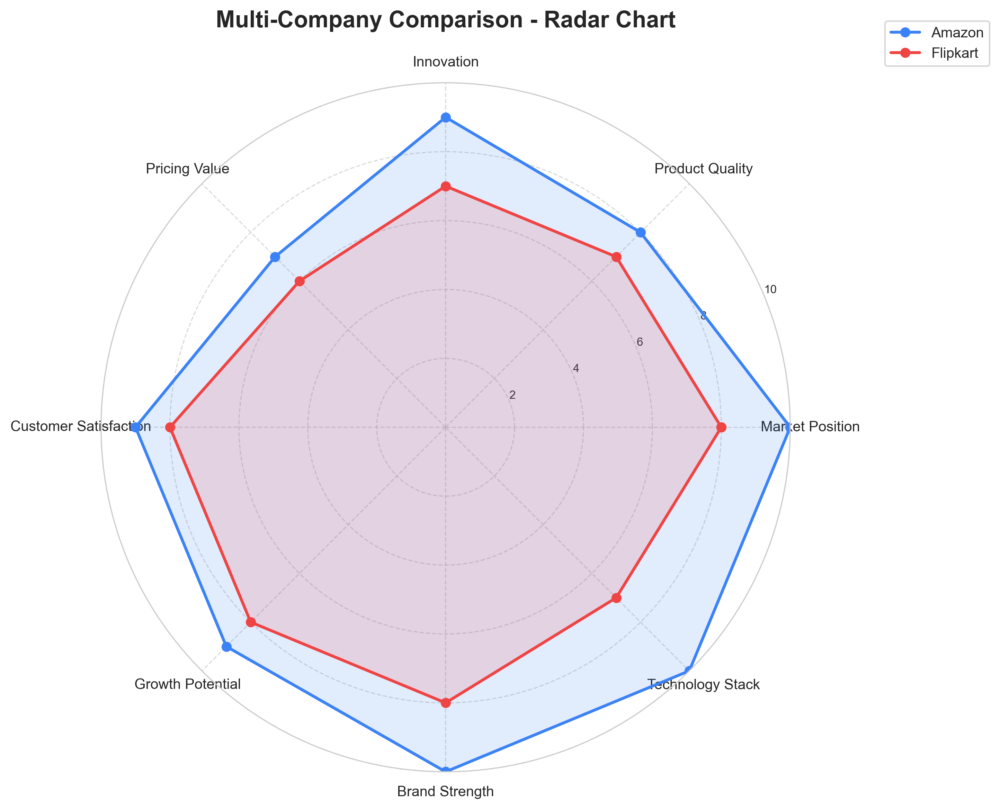

# 🎯 Competitive Analysis Agent

> **AI-Powered Market Intelligence & Competitor Research Platform**

A sophisticated multi-agent system built with Google's Gemini ADK that automates competitive analysis for businesses. Leverages AI to research companies, analyze competitors, generate SWOT analysis, and create comprehensive reports with interactive visualizations.

[](https://www.python.org/downloads/)
[](https://ai.google.dev/)
[](https://streamlit.io/)
[](https://opensource.org/licenses/MIT)

**🏆 Capstone Project for Google-Kaggle 5-Day AI Agents Intensive Course (November 2025)**

---

## 📖 Table of Contents

- [Features](#-features)
- [Demo](#-demo)
- [Architecture](#-architecture)
- [Installation](#-installation)
- [Usage](#-usage)
- [Project Structure](#-project-structure)
- [Technical Stack](#-technical-stack)
- [Agent Workflow](#-agent-workflow)
- [Screenshots](#-screenshots)
- [API Keys Setup](#-api-keys-setup)
- [Contributing](#-contributing)
- [License](#-license)
- [Author](#-author)

---

## ✨ Features

### 🤖 **Multi-Agent System**
- **ResearcherAgent** - Web scraping and company intelligence gathering
- **AnalystAgent** - Competitive analysis, SWOT, and pricing strategy
- **ReportGeneratorAgent** - Professional markdown report compilation
- **ComparisonAgent** - Multi-company comparative analysis
- **VisualGeneratorAgent** - Data visualization (radar, bar, heatmap charts)

### 📊 **Analysis Capabilities**
- ✅ **Single Company Analysis** - Deep-dive research with 6-step pipeline
- ✅ **Multi-Company Comparison** - Side-by-side analysis (2-5 companies)
- ✅ **Automated SWOT Analysis** - AI-generated strategic insights
- ✅ **Pricing Strategy Analysis** - Market positioning evaluation
- ✅ **Visual Comparisons** - Professional charts and graphs

### 🎨 **Dual Interfaces**
- **CLI (main.py)** - Command-line interface for terminal users
- **Streamlit Web App (app.py)** - Modern, interactive web interface

### 📄 **Export Options**
- Markdown (.md) reports
- PDF documents with embedded charts
- High-resolution PNG charts (300 DPI)
- Session state persistence

---

## 🎬 Demo

### Single Company Analysis
```bash
python main.py
# Select: 1. Single Company Analysis
# Enter: Netflix
# Output: Netflix_competitive_analysis_20251130_190229.md
```

### Multi-Company Comparison
```bash
streamlit run app.py
# Select: Multi-Company Comparison
# Enter: Amazon, Flipkart
# Output: Comparison report + 3 visualization charts
```

---

## 🏗️ Architecture
```
┌─────────────────────────────────────────────────────────────┐
│                    USER INTERFACES                          │
│  ┌──────────────────┐         ┌─────────────────────┐      │
│  │   CLI (main.py)  │         │  Streamlit (app.py) │      │
│  └────────┬─────────┘         └──────────┬──────────┘      │
└───────────┼────────────────────────────────┼────────────────┘
            │                                │
┌───────────┼────────────────────────────────┼────────────────┐
│           ▼         AGENT ORCHESTRATION    ▼                │
│  ┌──────────────────────────────────────────────────────┐   │
│  │          ResearcherAgent (Step 1-2)                  │   │
│  │  • Company Research    • Competitor Discovery        │   │
│  └─────────────────────┬────────────────────────────────┘   │
│                        ▼                                     │
│  ┌──────────────────────────────────────────────────────┐   │
│  │           AnalystAgent (Step 3-5)                    │   │
│  │  • Competition Analysis  • SWOT  • Pricing           │   │
│  └─────────────────────┬────────────────────────────────┘   │
│                        ▼                                     │
│  ┌──────────────────────────────────────────────────────┐   │
│  │       ReportGeneratorAgent (Step 6)                  │   │
│  │  • Final Report Compilation                          │   │
│  └──────────────────────────────────────────────────────┘   │
│                                                              │
│  ┌──────────────────────────────────────────────────────┐   │
│  │    ComparisonAgent + VisualGeneratorAgent            │   │
│  │  • Multi-Company Comparison  • Charts Generation     │   │
│  └──────────────────────────────────────────────────────┘   │
└──────────────────────────────────────────────────────────────┘
            │                                │
┌───────────┼────────────────────────────────┼────────────────┐
│           ▼      EXTERNAL SERVICES         ▼                │
│  ┌──────────────────┐         ┌─────────────────────┐      │
│  │  Google Gemini   │         │     SerpAPI         │      │
│  │  2.5 Flash       │         │  (Web Search)       │      │
│  └──────────────────┘         └─────────────────────┘      │
└─────────────────────────────────────────────────────────────┘
```

---

## 🚀 Installation

### Prerequisites
- Python 3.13 or higher
- Google Gemini API key ([Get it here](https://ai.google.dev/))
- SerpAPI key ([Get it here](https://serpapi.com/))

### Step 1: Clone the Repository
```bash
git clone https://github.com/Ishan71845/competitive-analyst-agent.git
cd competitive-analyst-agent
```

### Step 2: Create Virtual Environment (Recommended)
```bash
# Windows
python -m venv venv
venv\Scripts\activate

# macOS/Linux
python3 -m venv venv
source venv/bin/activate
```

### Step 3: Install Dependencies
```bash
pip install -r requirements.txt
```

### Step 4: Configure API Keys
Create a `.env` file in the project root:
```bash
cp .env.example .env
```

Edit `.env` and add your API keys:
```env
GOOGLE_API_KEY=your_google_api_key_here
SERPAPI_KEY=your_serpapi_key_here
```

---

## 📖 Usage

### Option 1: Command-Line Interface (CLI)
```bash
python main.py
```

**Menu Options:**
1. **Single Company Analysis** - Analyze one company in detail
2. **Multi-Company Comparison** - Compare 2-5 companies with visualizations
3. **Exit**

### Option 2: Web Interface (Streamlit)
```bash
streamlit run app.py
```

Open your browser to `http://localhost:8501`

**Features:**
- Interactive company input
- Real-time progress tracking
- Inline report preview
- One-click PDF/Markdown export
- Visual chart display with tabs
- Session state management

---

## 📁 Project Structure
```
competitive-analyst-agent/
│
├── agents/                          # AI Agent modules
│   ├── __init__.py
│   ├── researcher.py                # Web research & data gathering
│   ├── analyst.py                   # Competitive & SWOT analysis
│   ├── report_generator.py          # Report compilation
│   ├── comparison_agent.py          # Multi-company comparison
│   └── visual_generator.py          # Chart generation
│
├── utils/                           # Utility functions
│   ├── __init__.py
│   └── tools.py                     # Search & scraping tools
│
├── .streamlit/                      # Streamlit configuration
│   └── config.toml
│
├── main.py                          # CLI entry point
├── app.py                           # Streamlit web app
├── api_config.py                    # API configuration
├── requirements.txt                 # Python dependencies
├── .env.example                     # Environment variables template
├── .gitignore                       # Git ignore rules
└── README.md                        # This file
```

---

## 🛠️ Technical Stack

### Core Technologies
| Technology | Version | Purpose |
|------------|---------|---------|
| **Python** | 3.13 | Core language |
| **Google Gemini** | 2.5 Flash | AI analysis engine |
| **Streamlit** | 1.51.0 | Web interface |
| **SerpAPI** | 2.4.2 | Web search |
| **ReportLab** | 4.4.5 | PDF generation |
| **Matplotlib** | 3.10.7 | Data visualization |
| **Seaborn** | 0.13.2 | Statistical graphics |

### Key Libraries
- `google-genai` - Google AI SDK
- `python-dotenv` - Environment management
- `requests` - HTTP requests
- `beautifulsoup4` - HTML parsing
- `pandas` - Data manipulation
- `Pillow` - Image processing

---

## 🔄 Agent Workflow

### Single Company Analysis (6-Step Pipeline)
```
Step 1: Company Research
↓
Step 2: Competitor Discovery
↓
Step 3: Competitive Analysis
↓
Step 4: SWOT Generation
↓
Step 5: Pricing Analysis
↓
Step 6: Report Compilation
↓
Output: Markdown Report (.md)
```

### Multi-Company Comparison
```
For Each Company (2-5):
  ↓ Step 1-5: Individual Analysis
  ↓
Aggregate All Company Data
  ↓
Comparative Analysis
  ↓
Visual Chart Generation (Radar, Bar, Heatmap)
  ↓
Output: Comparison Report + 3 PNG Charts
```

---

## 📸 Screenshots

### CLI Interface
```
============================================================
🚀 COMPETITIVE ANALYSIS AGENT
============================================================

Select analysis mode:
1. Single Company Analysis
2. Multi-Company Comparison (with visual charts)
3. Exit

Enter your choice (1-3):
```

### Streamlit Web Interface
*(Add actual screenshots after deployment)*

**Homepage:**
- Company input form
- Analysis mode selector
- Progress indicators

**Results Page:**
- Formatted markdown report
- Interactive chart tabs
- Download buttons (MD/PDF)

### Sample Outputs

**Radar Chart Example:**


**Comparison Report Structure:**
```markdown
# Multi-Company Competitive Comparison
*Comparing: Amazon, Flipkart*

## 1. Market Position Comparison
## 2. Product & Service Comparison
## 3. Competitive Advantages
## 4. Competitive Weaknesses
## 5. Pricing Strategy Comparison
## 6. SWOT Comparison Matrix
## 7. Head-to-Head Analysis
## 8. Strategic Positioning
## 9. Winner Analysis
## 10. Final Verdict
```

---

## 🔑 API Keys Setup

### Google Gemini API
1. Visit [Google AI Studio](https://ai.google.dev/)
2. Sign in with Google account
3. Generate API key
4. Copy key to `.env` file

### SerpAPI
1. Visit [SerpAPI](https://serpapi.com/)
2. Create free account (100 searches/month)
3. Copy API key from dashboard
4. Add to `.env` file

**Security Note:** Never commit `.env` file to Git. Use `.env.example` as template.

---

## 🤝 Contributing

Contributions are welcome! Please follow these steps:

1. Fork the repository
2. Create feature branch (`git checkout -b feature/AmazingFeature`)
3. Commit changes (`git commit -m 'Add AmazingFeature'`)
4. Push to branch (`git push origin feature/AmazingFeature`)
5. Open Pull Request

---

## 📄 License

This project is licensed under the MIT License - see the [LICENSE](LICENSE) file for details.
```
MIT License

Copyright (c) 2025 Ishan

Permission is hereby granted, free of charge, to any person obtaining a copy
of this software and associated documentation files (the "Software"), to deal
in the Software without restriction, including without limitation the rights
to use, copy, modify, merge, publish, distribute, sublicense, and/or sell
copies of the Software, and to permit persons to whom the Software is
furnished to do so, subject to the following conditions:

The above copyright notice and this permission notice shall be included in all
copies or substantial portions of the Software.

THE SOFTWARE IS PROVIDED "AS IS", WITHOUT WARRANTY OF ANY KIND, EXPRESS OR
IMPLIED, INCLUDING BUT NOT LIMITED TO THE WARRANTIES OF MERCHANTABILITY,
FITNESS FOR A PARTICULAR PURPOSE AND NONINFRINGEMENT.
```

---

## 👨‍💻 Author

**Ishan**
- 🎓 B.Tech Computer Science (Blockchain Technology Specialization)
- 🏫 MIT School of Engineering, Pune
- 📧 ishan71845@gmail.com (optional)
- 💼 [LinkedIn](www.linkedin.com/in/ishanshrivastava1511)
- 🐙 [GitHub](https://github.com/Ishan71845)

**Capstone Project:** Google-Kaggle 5-Day AI Agents Intensive Course  
**Submission Date:** December 1, 2025

---

## 🙏 Acknowledgments

- **Google & Kaggle** - For the AI Agents Intensive Course
- **Anthropic** - For Gemini AI technology
- **SerpAPI** - For web search capabilities
- **Streamlit** - For the amazing web framework

---

## 📊 Project Stats

- **Total Agents:** 5
- **Total Lines of Code:** ~1,500+
- **Analysis Steps:** 6 (Single) / 10 (Comparison)
- **Chart Types:** 3 (Radar, Bar, Heatmap)
- **Export Formats:** 3 (Markdown, PDF, PNG)

---

<div align="center">

**⭐ If you find this project useful, please consider giving it a star!**

Made with ❤️ using Google Gemini ADK

</div>